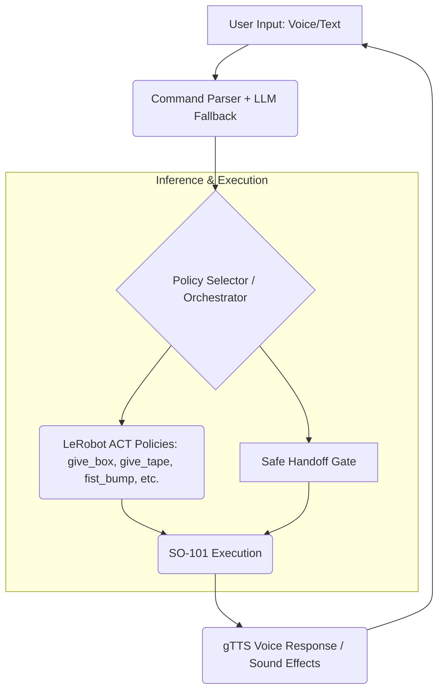

### JARVIS: Just A Rather Very Intelligent System

### Collaborative AI Assistant using LeRobot and AMD MI300X

## Demo Video 
**[Watch JARVIS in Action Here!](https://www.google.com/search?q=link_to_demo_video)**

*Video highlights: Conversational command \rightarrow Safe handoff \rightarrow Assembly sequence \rightarrow Fist bump celebration \rightarrow Tic-Tac-Toe.*

---

## Project Summary

JARVIS transforms the SO-101 robotic arm into an intuitive, multi-modal coworker. Our system's core mission is to protect human workflow and focus in high-precision environments. Instead of relying on buttons or complex code, JARVIS allows users to request tools and components using **natural voice commands**.

**The JARVIS Difference:** It doesn't just execute; it collaborates. It sees your hand for a safe handoff, hears your commands (Google Speech Recognition), and responds contextually with personality (Llama 3.2), making human-robot interaction natural, safe, and even enjoyable.

## Team Information
| Detail | Value |
| --- | --- |
| **Team Name** | MasterBlasters |
| **Team Number** | 16 |
| **Members** | Syed Muhammad Abubakar, Eris Lala |

---

## Mission 1: print("Hello World")
This mission was there for us to understand better the lerobot and the tools provided by AMD

[Watch the demo video](https://github.com/user-attachments/assets/055a1938-6cb3-4a7d-97e6-0ec5a299487c)


## Mission 2: 
## 1. Mission Description: The Hands-Free Teammate 🤝
### Real-World Application: 
Preserving Human FocusThe central use case is simple yet critical: preventing the loss of focus when a worker needs a tool. Imagine a surgeon, an assembly line technician, or an electronics maker who can request a tool without looking away from their delicate task.

JARVIS addresses this need, enabling:
* **Focus State Protection:** Hands-free retrieval of tools and components via voice commands.
* **Proactive, Safe Collaboration:** The robot anticipates needs and uses hand detection to ensure the object is only released into a ready human hand.
* **Target Environments:** Manufacturing, automotive assembly, specialized workshops, surgical rooms, and research laboratories.

## 2. Creativity & Innovation ✨
JARVIS sets a new standard for human-robot interaction by integrating **Personality** and **Multi-Modal Intelligence**.

| Feature | Traditional Robots | JARVIS |
| --- | --- | --- |
| **Intelligence** | Single-modal (Vision OR Command) | **Multi-modal (Sees, Hears, Reads, Thinks)** |
| **Socialization** | None | **Fist bumps, compliments, and playable games (Tic-Tac-Toe)** |
| **Interaction** | Fixed Scripts/Buttons | **Natural Voice + LLM Conversational Fallback** |
| **Handoff Safety** | Fixed location drop-off | **Dynamic, Hand-Detection Gated Release** |

### Key Creative Innovations:* **The Personality Engine:** JARVIS is programmed with dynamic, personable reactions (e.g., "Your wish is my command!"), compliments ("Great grip!"), and 20+ easter egg responses, transforming a tool into a teammate.
* **Orchestrated Policy Architecture:** We trained specialized LeRobot policies (ACT architecture) for specific actions (*give_box*, *fist_bump*, *take_from_hand*) and built an intelligent orchestrator to seamlessly select and switch between them based on LLM context.
* **Gamification:** The ability to execute a celebratory **Fist Bump** and play **Tic-Tac-Toe** (fully implemented) showcases the system's potential for complex, non-industrial social interaction.

## 3. Technical Implementation
### Architecture Overview
The system runs on the Ryzen AI 9 HX 370, orchestrating multiple concurrent AI pipelines:
https://github.com/user-attachments/assets/9a64c35d-0ad0-4249-b28e-49b96f4a66f7



### Dataset Capture & Training
* **Hardware Used:** SO-101 Leader-Follower setup and Dual Camera System.
* **Training:** Performed on the **AMD MI300X GPU Cluster** using the LeRobot framework.
* **ACT Policy:** Action Chunking Transformer was used for its superior performance in sequence modeling.
* **Strategic Policy Split:** Separate policies were trained for each object to maximize **giving stability**, but a single generalized policy was used for **taking** objects back to maximize training efficiency.

For mission 1: 
[model](https://huggingface.co/Abubakar17/so101-policy)
[dataset](https://huggingface.co/datasets/Abubakar17/record-test-5)

For mission 2:
There were 2 ways to inference to deal with the inference
 1. model orchestration
 2. policy orchestration

We tried both methods and all the datasets and models can be found [here](https://huggingface.co/Abubakar17)


### Inference Stack
* **Platform:** Dell Pro Max 16 Laptop (Ryzen AI 9 HX 370).
* **LLM:** **Ollama (Llama 3.2)** provides rapid, local conversational intelligence.
* **Interface:** Custom, production-ready **Streamlit UI** for visualization, control, and status monitoring.

## 4. Ease of Use and Generalizability ⚙️
### Multi-Interface ControlJARVIS provides maximum flexibility for the user:
* **Voice:** The primary mode; hands-free operation.
* **Text:** Type commands in the UI for noisy environments.
* **Buttons:** One-click shortcuts for accessibility or quick demos.

### Extensibility (Generalizability)
The system is designed to be easily expanded without retraining the entire policy architecture:
* **Adding New Objects (e.g., *screwdriver*):**
1. Record \sim50 new demonstration episodes.
2. Train a new, small LeRobot policy for the object.
3. Register the new policy path and object keyword in the Orchestrator.


* **Adaptability:**
* Camera indices, USB ports, and recognition sensitivities are all adjustable via the configuration file.

### No Code Required for End User
The end user interacts entirely through the intuitive visual interface or voice. The system features a clear UI with a real-time visualization, command history, and a prominent **One-Click Emergency Stop**.

## 🛠️ Installation & Setup
### Prerequisites
* Ubuntu 22.04+
* Python 3.10+
* Required hardware: SO-101 Robotic Arm, two USB cameras.

### Local Setup
```bash
# Clone the repository
git clone https://github.com/Serialii/AMD_Robotics_Hackathon_2025_Jarvis
cd jarvis_robotics

# Create and activate environment
conda create -n jarvis python=3.10
conda activate jarvis

# Install dependencies (including AMD-optimized libraries if applicable)
pip install -r requirements.txt

# Download model weights (optional, link provided for trained policies)
# ... script to download trained ACT policies ...

# Install Ollama and pull Llama 3.2 for local conversational AI
# (Ollama setup instructions)
ollama pull llama_3.2

# Run the UI
streamlit run jarvis.py

```

